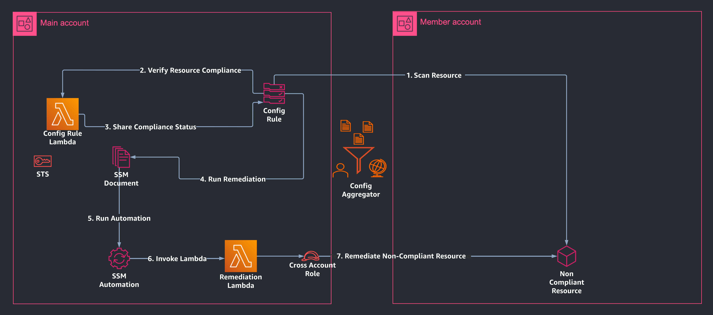

# Multi-Account Guardrail Compliance Check and Auto-Remediation
## Goal
* Ensure that all VPCs have Flow logs across multiple member accounts
* Check for compliance of VPCs across member accounts 
* Report non-compliant VPC Ids using AWS Config Rule in the main account
* Upon detection, AWS Config Rule triggers an SSM document which invokes the Remediation Lambda that enables VPC Flow Logs in the non-compliant VPCs.

## Architecture Diagram

## Inventory
This repository contains 2 functions designed to:
1. Detect Non-Compliant VPCs across multiple accounts - [vpc_flowlog.py](https://github.com/PaushaliKunduTR/governance-guardrails/blob/main/src/lambda/vpc_flow_log.py)
2. Remediate and enable the non-compliant resources upon detection - [vpc_flow_log_remediation.py](https://github.com/PaushaliKunduTR/governance-guardrails/blob/main/src/lambda/vpc_flow_log_remediation.py)

It also contains an example YAML used in the SSM Document created to invoke the remediation Lambda

## Set Up
*  Create IAM roles with appropriate cross-account read/write permissions to the resources of the following services:
    * AWS Lambda
    * AWS Config
    * AWS Systems Manager
    * Amazon CloudWatch
    * Amazon VPC
* Create a Lambda function using example code from [vpc_flowlog.py](https://github.com/PaushaliKunduTR/governance-guardrails/blob/main/src/lambda/vpc_flow_log.py)
* Create a custom Config Rule and add the ARN of the Lambda function
* Select Periodic trigger and add "IncludeMemberAccounts" as a parameter key with "True" value
* Create a Remediation Lambda function using the example code from [vpc_flow_log_remediation.py](https://github.com/PaushaliKunduTR/governance-guardrails/blob/main/src/lambda/vpc_flow_log_remediation.py)
* Create an SSM Automation Document using the example [YAML](https://github.com/PaushaliKunduTR/governance-guardrails/blob/main/src/remediate-flowlog-custom-org.yaml) provided to invoke the Remediation Lambda. Replace assumeRole value in the document with the AutomationAssumeRole created.
* Select "Manage Remediation" in the Actions menu of the Config Rule and select "Automatic Remediation"
* Select the created SSM document from "Choose Remediation Action" dropdown
* Select "ImpactedVPC" as Resource ID Parameter

## Execution/ Simulation
* Create new VPCs in the member accounts with no flow logs enabled (Make sure that the accounts are member accounts and the lambdas have permissions to access them)
* Go to the Config Rule and select "Re-evaluate" in "Actions".
* Post successful execution, the VPCs should have Flow Logs attached to them

